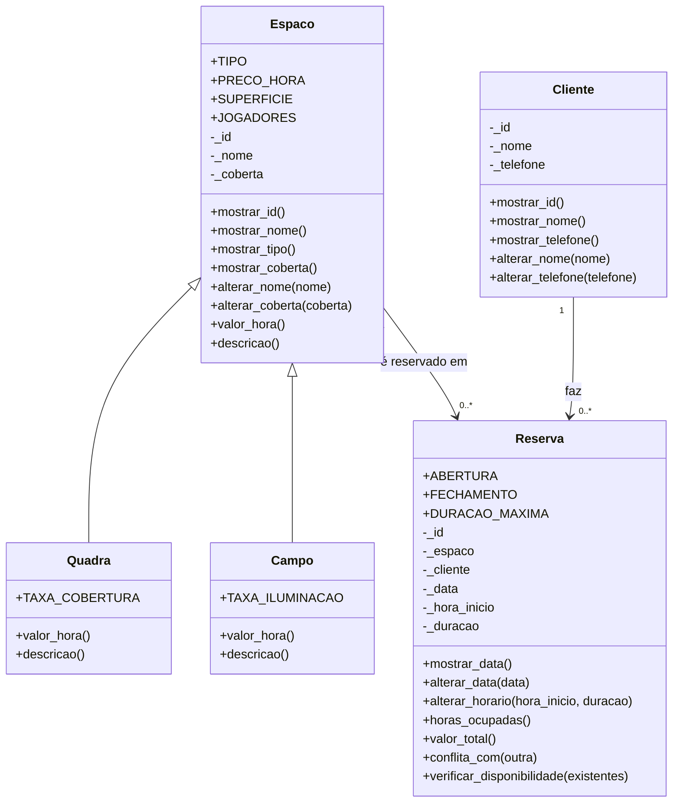

# Quadras & Campos API

Backend de agendamento de horários para aluguel de quadras e campos esportivos.
Prova de POO (prof. Rodrigo) — Eduardo Oliveira, Eduardo França, Gabriel Jesus e Gabriel Pilar.

**Domínio:** o cliente escolhe uma quadra ou campo, uma data e um horário; a reserva só é aceita se o
espaço estiver livre e dentro do horário de funcionamento (8h às 23h, de 1 a 4 horas seguidas).
O preço vem do próprio espaço (polimorfismo): campo e quadra cobram valores diferentes.

> O tema "Quadras & Campos" não está entre os 12 do enunciado, então seguimos o mesmo esqueleto:
> entidade principal (Espaco), hierarquia (Espaco -> Quadra, Campo) e o registro que liga as duas (Reserva).

## Como rodar

```bash
pip install -r requirements.txt
uvicorn main:app --reload
```

Documentação interativa em http://127.0.0.1:8000/docs. Para verificar tudo: `python verificar.py`.

## Diagrama de classes



Relacionamentos: **herança** entre Espaco e suas filhas (Quadra/Campo *são* um Espaco); **associação** entre
Reserva e Espaco/Cliente (a reserva *guarda* referências, mas nenhum dos dois depende dela para existir).

## Estrutura

```
quadras-campos-api/
├── main.py
├── verificar.py
├── requirements.txt
└── app/
    ├── data/         mocks (espaco, cliente, reserva) — só dicionários
    ├── models/       Espaco/Quadra/Campo, Cliente, Reserva, ConflitoError — sem FastAPI
    ├── controllers/  casos de uso; devolvem dicionário, None ou lista vazia
    └── routes/       endereços e códigos HTTP (404, 409, 422, 201)
```

## Rotas

| Método | Rota | Descrição | Códigos |
|---|---|---|---|
| GET | `/api/espacos` | Lista quadras e campos (filtro `?tipo=quadra` ou `campo`) | 200 |
| GET | `/api/espacos/{id}` | Um espaço, com valor/hora | 200, 404 |
| GET | `/api/espacos/{id}/agenda/{data}` | Reservas do dia e horários livres | 200, 404 |
| POST | `/api/reservas` | Agenda um horário | 201, 404, 409, 422 |
| DELETE | `/api/reservas/{id}` | Cancela e libera o horário | 200, 404 |
| GET | `/api/clientes` | Lista os clientes | 200 |
| GET | `/api/clientes/{id}` | Um cliente | 200, 404 |
| GET | `/api/clientes/{id}/reservas` | Histórico do cliente | 200, 404 |
| GET | `/api/relatorio/faturamento` | Total e total por espaço | 200 |

Exemplo de corpo do `POST /api/reservas`:

```json
{"espaco_id": 2, "cliente_id": 1, "data": "2026-12-01", "hora_inicio": 10, "duracao": 2}
```

## Quem fez o quê

Divisão completa, com arquivos e fluxo de trabalho, em [DIVISAO-DE-TAREFAS.md](DIVISAO-DE-TAREFAS.md).

| Integrante | GitHub | Responsabilidade |
|---|---|---|
| Eduardo Oliveira | @eduardo3071 | Hierarquia: `CampoSociety`, herança e `super()` |
| Eduardo França | @EduardoFranca2805 | Regra de antecedência mínima e checagens |
| Gabriel Jesus | @Senseei | Controllers e mocks |
| Gabriel Pilar | @GenezisDev | Rotas de clientes e documentação |

## Saída do verificar.py

```
[OK] Atributos são protegidos (sem acesso público a nome/id)
[OK] Não existe alterar_id em nenhuma classe
[OK] Construtor valida: nome curto de espaço levanta ValueError
[OK] Construtor valida: telefone inválido levanta ValueError
[OK] Regra: data inválida levanta ValueError
[OK] Regra: duração fora de 1-4h levanta ValueError
[OK] Regra: fora do horário de funcionamento levanta ValueError
[OK] Hierarquia: Quadra e Campo herdam de Espaco
[OK] Constante de classe PRECO_HORA difere nas filhas
[OK] super() estende valor_hora (quadra coberta = base + taxa)
[OK] Polimorfismo: valor_hora difere entre quadra e campo
[OK] PERFIS mapeia texto do mock para classe
[OK] Valor total da reserva = valor_hora x duração
[OK] Conflito de horário levanta ConflitoError
[OK] GET /api/espacos devolve a lista
[OK] Filtro ?tipo=campo só devolve campos
[OK] GET /api/espacos/{id} inexistente -> 404
[OK] GET /api/espacos/{id}/agenda/{data} mostra horas livres
[OK] POST /api/reservas declara status 201
[OK] POST /api/reservas válida cria a reserva
[OK] POST /api/reservas no mesmo horário -> 409
[OK] POST /api/reservas fora do expediente -> 422
[OK] POST /api/reservas com espaço inexistente -> 404
[OK] GET /api/clientes/{id}/reservas inexistente -> 404
[OK] DELETE /api/reservas/{id} inexistente -> 404
[OK] Cancelar libera o horário (recriar não dá 409)
[OK] GET /api/relatorio/faturamento soma as reservas
[OK] Nenhum import de FastAPI dentro de app/models
[OK] Nenhum if comparando tipo ou nome de classe no projeto
[OK] Mocks não têm import nem classe

30/30 checagens passaram.
```
